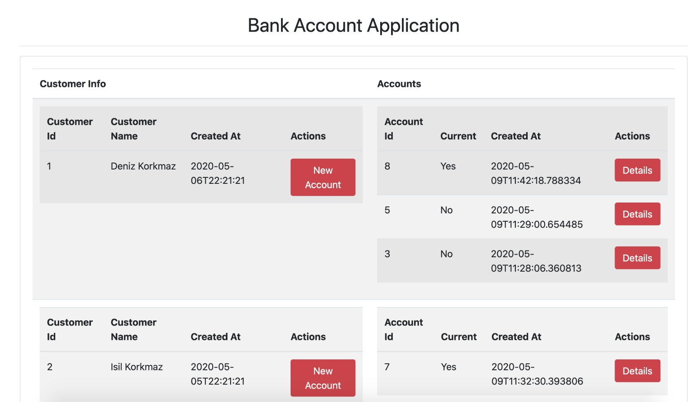
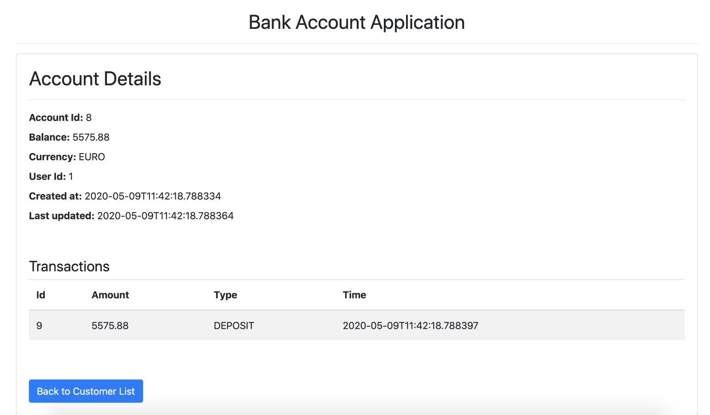
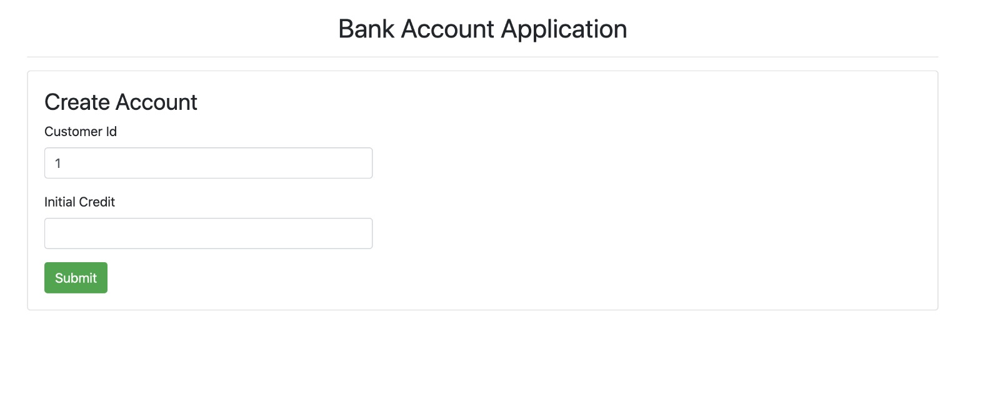

# Bank Account Client

This project is a simple bank account application client which is generated with [Angular CLI](https://github.com/angular/angular-cli) version 9.1.4.

For testing, you need to run [backend](https://github.com/adenizkorkmaz/bank-account) service first. 

Please find the screenshots of the application below.

## Development server

If you do not have angular cli, fist you should install it.
`npm install -g @angular/cli` 

Then you need to install packages
`npm install`

Run `ng serve` for a dev server. Navigate to `http://localhost:4200/`. The app will automatically reload if you change any of the source files.

## Screenshots

## Build

Run `ng build` to build the project. The build artifacts will be stored in the `dist/` directory. Use the `--prod` flag for a production build.

## Further help

To get more help on the Angular CLI use `ng help` or go check out the [Angular CLI README](https://github.com/angular/angular-cli/blob/master/README.md).
